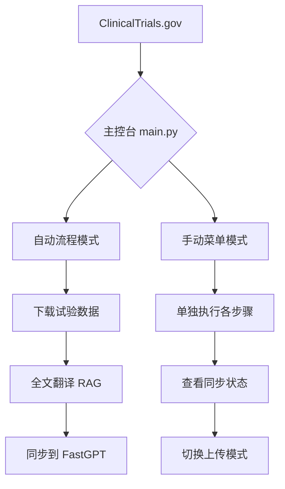

# 胰腺癌临床试验自动化情报与 RAG 知识库系统

**Pancreatic Cancer Clinical Trials Automation & RAG System**

一套针对胰腺癌（Pancreatic Cancer）设计的闭环情报系统：从 ClinicalTrials.gov 自动抓取、双路径处理（TG 推送 + 全文精翻）、深度清洗，并自动同步至 FastGPT 私有化 RAG 知识库。


---

## 🎯 核心业务流程



---

## 📋 核心功能

### 🆕 统一主控台 (`main.py`)

- **自动流程**：一键执行下载 → 翻译 → 上传全链路
- **手动菜单**：独立控制各个步骤
- **模式切换**：支持"仅当天"或"全部含历史"上传模式
- **状态监控**：实时查看 FastGPT 同步状态

### 1. 自动化情报抓取 (`daily_ctgov_check_tgbot.py`)

- **双协议支持**：基于 CTGov API v2，支持智谱 GLM-4 与 Gemini 双模型
- **中国中心识别**：自动检索试验中心列表，含有中国医院的试验将加上高亮标记
- **极简简报**：生成包含 NCT ID、标题、阶段、发起方及中国中心信息的极简 TG 推送

### 2. RAG 全量精翻 (`ctgov_full_sync_rag.py`)

- **JSON 深度清洗**：递归删除 `ancestors`、`conditionBrowseModule` 等 RAG 冗余字段，提升索引信噪比
- **结构化补全**：在 Markdown 报告中强制补全"发起方信息"与"详细试验中心医院列表"
- **全文翻译**：将复杂的医学文本翻译为患者友好的中文 Markdown 文档

### 3. FastGPT 智能同步 (`fastgpt_sync.py`)

- **NCT 去重**：基于 NCT 编号的唯一性校验，确保"一号一文"，防止冗余
- **Hash 指纹**：利用 `sync_state.json` 记录文件哈希，仅同步新增或修改的内容
- **日期过滤**：支持"仅当天"或"全部含历史"模式
- **集合缓存**：`history` 目录文件统一归档到单一集合，其他按项目目录归类
- **私有云优化**：适配 `multipart/form-data` 上传协议，支持多维身份注入

---

## 🚀 快速开始

### 1️⃣ 环境配置

克隆项目后，配置 `.env` 文件：

```bash
# LLM 配置
LLM_PROVIDER=zhipu # 或 gemini
zhipu_api_key=your_key
gemini_api_key=your_key

# FastGPT 配置
FASTGPT_BASE_URL=https://your-domain.com/api
FASTGPT_API_KEY=openapi-your-key
FASTGPT_DATASET_ID=your_dataset_id
FASTGPT_LOCAL_DIR=["/path/to/output", "/path/to/trials"]

# Telegram 配置
TELEGRAM_BOT_TOKEN=your_token
TELEGRAM_CHAT_ID=your_id
```

### 2️⃣ 运行方式

#### 🔥 推荐：使用主控台

```bash
# 交互式菜单（默认仅上传当天文件）
python3 main.py

# 自动流程（适合定时任务）
python3 main.py --auto
```

#### 独立执行各模块

```bash
# 1. 下载最新试验数据
python3 daily_ctgov_check_tgbot.py

# 2. 生成精翻文档
python3 ctgov_full_sync_rag.py

# 3. 推送至 FastGPT
python3 fastgpt_sync.py --once --mode=today  # 仅当天
python3 fastgpt_sync.py --once --mode=all    # 全部含历史
```

---

## 🏗️ 目录结构

```text
.
├── main.py              # 🆕 主控台脚本
├── output/              # 文档落地根目录
│   └── {Date-Topic}/    # 课题子目录
│       ├── cn/          # RAG 专用中文 Markdown (同步目标)
│       └── en/          # 原始英文 Markdown
├── cache/               # CTGov 数据本地缓存
├── data/
│   └── fastgpt_sync_state.json  # FastGPT 同步指纹库（NCT去重）
├── fastgpt_sync.py      # FastGPT 同步引擎
├── ctgov_full_sync_rag.py # 全文精翻引擎
├── daily_ctgov_check_tgbot.py # TG 简报推送
└── .env                 # 核心环境配置
```

---

## 🔧 同步机制详解

### NCT 唯一去重

- 从文件名提取 `NCT\d{8}` 作为唯一标识
- 同一 NCT 编号的文件，无论文件名如何变化，系统识别为同一试验
- 示例：
  - `NCT06959615.md`
  - `2026-01-24-NCT06959615-A Multicenter...-zh.md`
  - 均识别为 `NCT06959615`

### Hash 内容校验

- 对文件内容进行 MD5 哈希计算
- 内容未变化则跳过上传
- 内容更新时自动触发"Updating"操作

### 集合命名规则

1. **history 目录**：所有文件统一归档到 `history` 集合
2. **技术子目录**（`zh/cn/en`）：自动向上提取业务目录名
3. **普通目录**：直接使用父目录名作为集合名

---

## 🛡️ 数据清洗逻辑

为了确保 RAG 问答的准确性，系统在处理原始 JSON 时会强制剔除以下模块：

- `ancestors`
- `conditionBrowseModule`
- `interventionBrowseModule`
- `derivedSection`

这些模块通常包含大量泛化的医学术语，会产生严重的索引噪音。

---

## 🎓 使用提示

- **中国标记**：所有涉及中国中心的试验在 TG 推送中会显示为 `🇨🇳`
- **上传模式**：
  - `today`：仅上传当天生成的文件（文件名以 `YYYY-MM-DD` 开头）
  - `all`：上传所有文件（包括历史）
- **重试机制**：同步脚本内置了 3 次重试，适配不稳定的网络环境
- **私有化适配**：针对 FastGPT 私有化部署，路径已优化为 `/api/core/dataset/...`

---

## 📝 更新日志

### v2.0.0 (2026-01-29)

- 新增 `main.py` 主控台，支持自动流程和手动菜单
- 新增上传模式切换（仅当天/全部含历史）
- 优化 NCT 去重逻辑，基于编号而非文件名
- 新增 Hash 内容指纹校验，避免重复上传
- 新增 `history` 目录集合统一归档
- 新增集合 ID 缓存机制，减少 API 调用

---

## 📜 开源协议

本项目采用 **AGPL-3.0 + 非商业性使用限制**

- ✅ 允许：个人学习、研究、非盈利组织使用
- ❌ 禁止：任何商业用途、盈利性服务
- 📝 要求：修改后必须开源，注明出处

详情参见：[LICENSE](./LICENSE)

---

**作者**：感谢❤️小胰宝社区志愿者团队的❤️开源  
**最后更新**：2026-01-29
