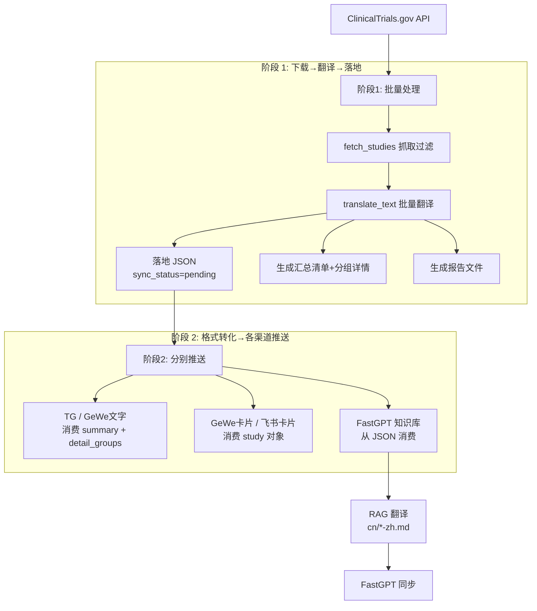

# 临床试验自动化情报与 RAG 知识库系统

**Clinical Trials Automation & RAG System — 多癌症/病种通用平台**

一套支持**多种癌症与罕见病**的闭环情报系统：从 ClinicalTrials.gov 自动抓取、双路径处理（TG 推送 + 全文精翻）、深度清洗，并自动同步至 FastGPT 私有化 RAG 知识库。覆盖胰腺癌、乳腺癌、肺癌、胃癌等各类癌症及罕见病，一次部署按需切换病种。


---

## 🎯 核心业务流程

系统采用 **两阶段分离架构**:阶段 1 批量处理所有试验(下载→翻译→落地),阶段 2 各推送渠道从已生成的内容中消费。这避免了「单篇下载翻译就推送导致中途卡住」的问题。


```mermaid
graph TD
    A[ClinicalTrials.gov API] --> B[阶段1: 批量处理]

    subgraph 阶段1[阶段 1: 下载→翻译→落地]
        B --> C[fetch_studies 抓取过滤]
        C --> D[translate_text 批量翻译]
        D --> E1[落地 JSON<br/>sync_status=pending]
        D --> E2[生成汇总清单+分组详情]
        D --> E3[生成报告文件]
    end

    E1 --> F[阶段2: 分别推送]

    subgraph 阶段2[阶段 2: 格式转化→各渠道推送]
        F --> G1[TG / GeWe文字<br/>消费 summary + detail_groups]
        F --> G2[GeWe卡片 / 飞书卡片<br/>消费 study 对象]
        F --> G3[FastGPT 知识库<br/>从 JSON 消费]
    end

    G3 --> H1[RAG 翻译<br/>cn/*-zh.md]
    H1 --> H2[FastGPT 同步]
```

### 📦 内容链路与文件流转

不同推送渠道消费的内容源**完全独立**,各有专属格式:

| 内容类型 | 消费渠道 | 文件/数据 | 说明 |
|---------|---------|----------|------|
| **汇总清单 + 分组详情** | TG、GeWe 文字 | `telegram_push_report.txt` | 简报格式,Markdown 文本 |
| **原始 study 对象** | GeWe 卡片、飞书卡片 | 内存中 | 结构化字段(标题/状态/联系人等) |
| **完整翻译 Markdown** | FastGPT 知识库 | `cn/{date}-{NCT}-{title}-zh.md` | 每篇独立完整精翻 |

### 🔬 FastGPT RAG 知识库的三步链路

FastGPT 推送的是**单个 study 的完整翻译文档**,而非汇总内容。完整链路:

```
阶段1 落地
  study JSON → output/{date}-Pancreatic_Cancer/{NCT}.json
               sync_status = "pending"  ← 待处理标记
                  │
                  ▼
阶段2-fastgpt 第1步 (ctgov_full_sync_rag.py:run_rag_translation)
  扫描所有 sync_status=="pending" 的 JSON
  对每个 study:
    ① format_to_markdown_en(study) → 完整英文 Markdown
    ② translate_text(全文)         → 精翻中文 Markdown
    ③ 落地两个文件:
       output/{date}-Pancreatic_Cancer/en/{date}-{NCT}-{title}.md     ← 英文原文
       output/{date}-Pancreatic_Cancer/cn/{date}-{NCT}-{title}-zh.md  ← 中文精翻
    ④ JSON 的 sync_status 改为 "synced"

阶段2-fastgpt 第2步 (fastgpt_sync.py --once)
  扫描所有含 "-zh" 的 .md 文件(中文精翻版)
  按 NCT 编号去重 + 内容 hash 去重
  上传到 FastGPT 知识库(按父目录名归类集合)
```

**关键约定**:
- JSON 的 `sync_status` 字段是 RAG 与抓取阶段的**隐式契约**:`pending` → 待翻译,`synced` → 已处理
- 中文精翻文件统一加 `-zh` 后缀,这是 FastGPT 同步的**过滤标识**
- `--mode=today` 时只传当天日期前缀的文件;`--mode=all` 传历史全部

---

## 📋 核心功能

### 🆕 统一主控台 (`main.py`)

- **自动流程**：一键执行下载 → 翻译 → 上传全链路
- **手动菜单**：独立控制各个步骤
- **模式切换**：支持"仅当天"或"全部含历史"上传模式
- **状态监控**：实时查看 FastGPT 同步状态
- **📤 推送已有报告**：独立推送已生成的报告文件到各渠道（v2.2.0 新增）

### 1. 自动化情报抓取 (`daily_ctgov_check_tgbot.py`)

- **双协议支持**：基于 CTGov API v2，支持智谱 GLM-4 与 Gemini 双模型
- **中国中心识别**：自动检索试验中心列表，含有中国医院的试验将加上高亮标记
- **极简简报**：生成包含 NCT ID、标题、阶段、发起方及中国中心信息的极简 TG 推送
- **多渠道推送**：支持 Telegram + 微信群（GeWe）双通道同步推送，详见下方[微信群推送](#-微信群推送gewe)

#### 💬 微信群推送（GeWe）

在 TG 推送基础上集成 [GeWe](https://api.geweapi.com) 个人微信群推送，与 TG **消息内容完全一致**，并额外支持可跳转卡片：

- **多群循环推送**：`GEWE_TO_WXID` 支持 JSON 数组 / 逗号分隔 / 单群三种写法，逐个群独立重试、**失败隔离**（某群失败不影响其他群）
- **可跳转卡片**：基于手动测试通过的 `appmsg` XML 模板，每个试验生成一张卡片，点击跳转 ClinicalTrials.gov 详情页
- **🇨🇳 中国优先**：含中国中心的试验在**标题前缀 + 描述末尾**双重标注 `🇨🇳 中国有中心（优先关注）`
- **公众号适配**：Markdown 自动转纯文本（`#`→去掉、`**`→去掉、`-`→`•`、`[文](url)`→`文(url)`），按 `GEWE_MSG_MAX_LEN` 自动分批并加 `(续 i/n)` 尾标
- **零侵入**：与 TG 推送并列调用，复用已翻译内容，无额外 LLM 成本；微信失败不影响 TG 主渠道

### 2. RAG 全量精翻 (`ctgov_full_sync_rag.py`)

- **JSON 深度清洗**：递归删除 `ancestors`、`conditionBrowseModule` 等 RAG 冗余字段，提升索引信噪比
- **结构化补全**：在 Markdown 报告中强制补全"发起方信息"与"详细试验中心医院列表"
- **全文翻译**：将复杂的医学文本翻译为患者友好的中文 Markdown 文档

### 3. FastGPT 智能同步 (`fastgpt_sync.py`)

- **NCT 去重**：基于 NCT 编号的唯一性校验，确保"一号一文"，防止冗余
- **Hash 指纹**：利用 `sync_state.json` 记录文件哈希，仅同步新增或修改的内容
- **日期过滤**：支持"仅当天"或"全部含历史"模式
- **集合缓存**：`history` 目录文件统一归档到单一集合，其他按项目目录归类
- **私有云优化**：适配 `multipart/form-data` 上传协议，支持多维身份注入

---

## 🚀 快速开始

### 1️⃣ 环境配置

#### 使用 uv 创建虚拟环境（推荐）

```bash
# 创建 uv 虚拟环境
uv venv --python 3.12

# 激活环境
source .venv/bin/activate

# 安装依赖
uv pip install requests python-dotenv openai
```

#### 配置环境变量

克隆项目后，配置 `.env` 文件：

```bash
# LLM 配置
LLM_PROVIDER=zhipu # 或 gemini
zhipu_api_key=your_key
gemini_api_key=your_key

# FastGPT 配置
FASTGPT_BASE_URL=https://your-domain.com/api
FASTGPT_API_KEY=openapi-your-key
FASTGPT_DATASET_ID=your_dataset_id
FASTGPT_LOCAL_DIR=["/path/to/output", "/path/to/trials"]

# Telegram 配置
TELEGRAM_BOT_TOKEN=your_token
TELEGRAM_CHAT_ID=your_id

# 微信群推送配置 (GeWe 平台,可选)
GEWE_ENABLED=false                    # 总开关
GEWE_API_HOST=api.geweapi.com
GEWE_APP_ID=your_gewe_app_id
GEWE_TOKEN=your_gewe_token
# 多群用 JSON 数组(推荐)或逗号分隔
GEWE_TO_WXID=["group-wxid-1","group-wxid-2"]
GEWE_CARD_MODE=true                  # true=每个试验发可跳转卡片
```

> 💡 微信推送默认关闭（`GEWE_ENABLED=false`），不配置凭据也能正常运行；开启后缺失凭据会自动跳过，不影响 Telegram 主渠道。

### 2️⃣ 运行方式

#### 🔥 推荐：使用主控台

```bash
# 交互式菜单（默认仅上传当天文件）
python3 main.py

# 自动流程（适合定时任务）
python3 main.py --auto
```

#### 📘 CLI 指令速查

**抓取过滤器（阶段 1）**

| 参数 | 说明 | 示例 |
|------|------|------|
| `--condition "疾病名"` | 指定病种（默认 Pancreatic Cancer） | `--condition "Lymphoma"` |
| `--china` | 仅抓取含中国中心的试验 | `--china` |
| `--top N` / `--N` | 取前 N 个试验（简写 `--5` = `--top 5`） | `--top 5` |
| `--status STATUS` | 试验状态（默认 RECRUITING） | `--status "ACTIVE_NOT_RECRUITING"` |
| `--days-back N` | 时间窗天数（0 = 不过滤） | `--days-back 0` |
| `--latest` | 按最近更新排序（默认开启） | `--latest` |

**推送开关（阶段 2）**

| 参数 | 说明 | config.yaml 默认 |
|------|------|-----------------|
| `--send-tg` | Telegram | `true` |
| `--send-gewe-txt` | GeWe **文字**推送 | `true` |
| `--send-gewe-card` | GeWe **卡片**推送 | `false`（需显式开启） |
| `--send-feishu` | 飞书交互卡片 | `true` |
| `--send-fastgpt` | FastGPT 知识库同步 | `true` |

**多渠道简写**

| 参数 | 说明 | 示例 |
|------|------|------|
| `--channels 列表` | 逗号分隔多渠道同时推送 | `--channels tg,gewe_txt` |
| `--all-channels` | 开启所有渠道 | `--all-channels` |
| `--no-channels 列表` | 排除指定渠道 | `--no-channels gewe_card` |

> 💡 **优先级**：CLI 参数 > `config.yaml` 默认值。例如 `config.yaml` 中 `gewe_card: false`，但运行时加 `--send-gewe-card` 可强制开启。

**常用完整指令**

```bash
# 搜索淋巴瘤，推微信文字（全球范围，不过滤时间）
python3 main.py --condition "Lymphoma" --top 1 --send-gewe-txt --days-back 0

# 中国中心的乳腺癌，推 Telegram + 微信文字
python3 main.py --condition "Breast Cancer" --china --top 10 --channels tg,gewe_txt

# 全渠道推送当天试验
python3 main.py --all-channels

# 仅抓取不推送（落地 JSON 供后续处理）
python3 main.py --china --top 20 --condition "Lung Cancer"

# 自动全流程（适合 cron 定时任务）
python3 main.py --auto
```

#### 🌐 切换病种（v3.0.0 新增）

支持任意癌症/罕见病，通过 `--condition` 临时切换或改 `.env` 的 `SEARCH_CONDITION` 长期固定：

```bash
# 各类癌症
python3 main.py --top 1 --condition "Breast Cancer" --china --send-gewe-txt    # 乳腺癌
python3 main.py --top 1 --condition "Lung Cancer" --china --send-gewe-txt      # 肺癌
python3 main.py --top 1 --condition "Gastric Cancer" --china --send-gewe-txt   # 胃癌
python3 main.py --top 1 --condition "Colorectal Cancer" --china                # 结直肠癌(仅抓取不推送)

# 罕见病也支持(英文名即可,未映射中文会原样显示)
python3 main.py --top 5 --condition "Gaucher Disease" --china                  # 戈谢病
python3 main.py --top 5 --condition "Pancreatic Cancer" --china                # 胰腺癌(默认)
```

目录、标题、footer、FastGPT 集合会自动按病种区分。新增病种中文映射见 `lib/branding.py` 的 `_DISEASE_CN`。

#### 💡 新功能：推送已有报告

适用于已生成报告，需要补发到某个渠道或测试推送功能的场景：

```bash
# 推送最新报告到 GeWe 文字
python3 push_existing_report.py --latest --send-gewe-txt

# 推送指定文件到多个渠道
python3 push_existing_report.py --file output/2026-06-17-Pancreatic_Cancer/telegram_push_report.txt --channels tg,gewe_txt,feishu

# 推送到所有支持的渠道
python3 push_existing_report.py --latest --all-channels

# 或通过交互式菜单：main.py → 手动菜单 → 推送已有报告
```

详细使用说明参见：[docs/push_existing_report_usage.md](./docs/push_existing_report_usage.md)

#### 独立执行各模块

```bash
# 确保已激活 uv 虚拟环境
source .venv/bin/activate

# 1. 下载最新试验数据
python3 daily_ctgov_check_tgbot.py

# 2. 生成精翻文档
python3 ctgov_full_sync_rag.py

# 3. 推送至 FastGPT
python3 fastgpt_sync.py --once --mode=today  # 仅当天
python3 fastgpt_sync.py --once --mode=all    # 全部含历史
```

---

## 🏗️ 目录结构

```text
.
├── main.py              # 🆕 主控台脚本
├── push_existing_report.py  # 🆕 独立推送已有报告工具 (v2.2.0)
├── output/              # 文档落地根目录
│   └── {Date-Topic}/    # 课题子目录
│       ├── cn/          # RAG 专用中文 Markdown (同步目标)
│       ├── en/          # 原始英文 Markdown
│       └── telegram_push_report.txt  # 推送报告文件
├── cache/               # CTGov 数据本地缓存
├── data/
│   └── fastgpt_sync_state.json  # FastGPT 同步指纹库（NCT去重）
├── docs/
│   └── push_existing_report_usage.md  # 🆕 推送已有报告使用文档
├── lib/                 # 🆕 公共模块库
│   ├── channels/        # 推送渠道模块
│   │   ├── telegram.py  # Telegram 推送
│   │   ├── gewe.py      # GeWe 微信群推送
│   │   └── feishu.py    # 飞书推送
│   ├── ctgov_api.py     # ClinicalTrials.gov API 封装
│   ├── content_builder.py  # 推送内容构建器
│   └── config.py        # 配置管理
├── fastgpt_sync.py      # FastGPT 同步引擎
├── ctgov_full_sync_rag.py # 全文精翻引擎
├── daily_ctgov_check_tgbot.py # TG 简报推送
├── config.yaml          # 🆕 渠道与流程配置
└── .env                 # 核心环境配置
```

---

## 🔧 同步机制详解

### NCT 唯一去重

- 从文件名提取 `NCT\d{8}` 作为唯一标识
- 同一 NCT 编号的文件，无论文件名如何变化，系统识别为同一试验
- 示例：
  - `NCT06959615.md`
  - `2026-01-24-NCT06959615-A Multicenter...-zh.md`
  - 均识别为 `NCT06959615`

### Hash 内容校验

- 对文件内容进行 MD5 哈希计算
- 内容未变化则跳过上传
- 内容更新时自动触发"Updating"操作

### 集合命名规则

1. **history 目录**：所有文件统一归档到 `history` 集合
2. **技术子目录**（`zh/cn/en`）：自动向上提取业务目录名
3. **普通目录**：直接使用父目录名作为集合名

---

## 🛡️ 数据清洗逻辑

为了确保 RAG 问答的准确性，系统在处理原始 JSON 时会强制剔除以下模块：

- `ancestors`
- `conditionBrowseModule`
- `interventionBrowseModule`
- `derivedSection`

这些模块通常包含大量泛化的医学术语，会产生严重的索引噪音。

---

## 🎓 使用提示

- **中国标记**：所有涉及中国中心的试验在 TG 推送中会显示为 `🇨🇳`
- **上传模式**：
  - `today`：仅上传当天生成的文件（文件名以 `YYYY-MM-DD` 开头）
  - `all`：上传所有文件（包括历史）
- **重试机制**：同步脚本内置了 3 次重试，适配不稳定的网络环境
- **私有化适配**：针对 FastGPT 私有化部署，路径已优化为 `/api/core/dataset/...`

---

## 📚 开发文档

项目维护了以下开发文档，便于查阅和追溯：

- **[dev.log](./dev.log)** - 开发日志，记录功能开发过程、问题排查和解决方案
- **[docs/fastgpt_datasets_list.md](./docs/fastgpt_datasets_list.md)** - FastGPT 数据集列表（113个），包含数据集名称和 ID，便于快速查找和引用
- **[QUICKSTART.md](./QUICKSTART.md)** - 快速入门指南，详细介绍环境配置和首次运行步骤

---

## 📝 更新日志

### v3.0.0 (2026-06-21) — 多癌症/病种支持

- **🌐 多病种通用平台**：从胰腺癌单病种升级为多癌症/病种通用平台，支持任意疾病（各类癌症、罕见病等），无需为不同疾病新建仓库
  - 疾病由 `.env` 的 `SEARCH_CONDITION` 或命令行 `--condition` 控制，一次运行一种疾病
  - 落地目录、FastGPT 集合自动按疾病分（`output/{date}-{disease}/`）
  - 修复 `--condition` 不同步落地目录名的 bug
  - 已验证：胰腺癌、乳腺癌、胃癌端到端真实测试通过
- **🏷️ 品牌文案通用化**：新增 `lib/branding.py` 集中管理标题/footer
  - 胰腺癌保持「小胰宝」专属文案不变
  - 其它病种走通用「小x宝{疾病中文}」文案（标题带疾病中文名，footer 引导 opencare 社区）
  - 含疾病英中映射表，未命中的罕见病等回退原文
- **📚 开发约定**：品牌文案统一从 `lib/branding.py` 取，禁止业务代码硬编码

### v2.2.0 (2026-06-17)

- **📤 独立推送已有报告功能**：新增 `push_existing_report.py` 工具，支持将已生成的报告文件独立推送到各渠道
  - 支持指定文件路径或自动查找最新报告
  - 支持推送到 Telegram、GeWe 文字、飞书等渠道
  - 支持多渠道同时推送（`--all-channels` / `--channels`）
  - 自动解析报告文件格式（汇总、详情分组、结尾）
  - 在 `main.py` 手动菜单中新增交互式推送入口
  - 使用场景：补发报告、测试推送、定时推送、批量补发历史报告
- **🔧 代码重构**：推送渠道模块化，抽取到 `lib/channels/` 目录，提高代码复用性
- **📚 文档完善**：新增 `docs/push_existing_report_usage.md` 详细使用文档

### v2.1.0 (2026-06-14)

- **💬 微信群推送（GeWe）**：在 TG 推送基础上新增微信群推送通道，消息内容与 TG 一致
  - 多群循环推送，JSON 数组/逗号分隔/单群三种配置写法，失败隔离
  - 基于 `appmsg` XML 的可跳转卡片，点击直达 ClinicalTrials.gov 详情页
  - 🇨🇳 中国试验双重标注（标题前缀 + 描述末尾）
  - Markdown 转纯文本 + 按长度分批 + 失败重试 + 开关可控
- **🔧 安全加固**：脱敏 `.env.example` 中的真实密钥并清洗 git 历史；含凭据的调试文件统一加入 `.gitignore`

### v2.0.0 (2026-01-29)

- 新增 `main.py` 主控台，支持自动流程和手动菜单
- 新增上传模式切换（仅当天/全部含历史）
- 优化 NCT 去重逻辑，基于编号而非文件名
- 新增 Hash 内容指纹校验，避免重复上传
- 新增 `history` 目录集合统一归档
- 新增集合 ID 缓存机制，减少 API 调用

---

## 📜 开源协议

本项目采用 **AGPL-3.0 + 非商业性使用限制**

- ✅ 允许：个人学习、研究、非盈利组织使用
- ❌ 禁止：任何商业用途、盈利性服务
- 📝 要求：修改后必须开源，注明出处

详情参见：[LICENSE](./LICENSE)

---

**作者**：感谢❤️小胰宝社区志愿者团队的❤️开源  
**最后更新**：2026-06-17
